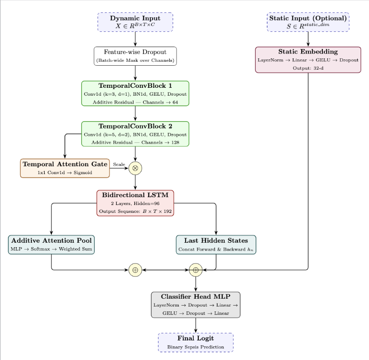
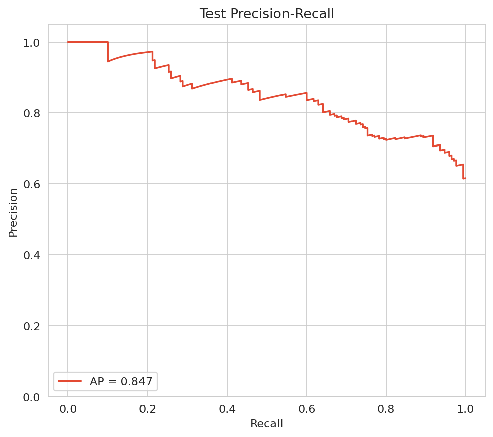
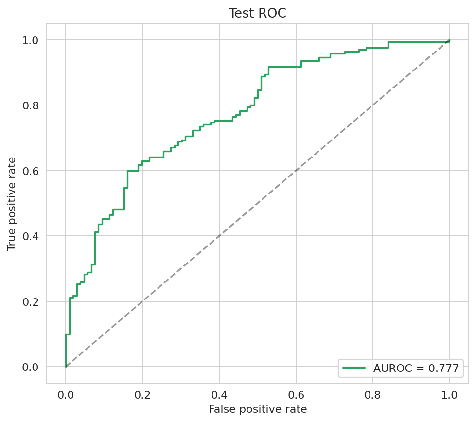

# Neonatal Sepsis Prediction

This project aims to build a model that can accurately predict **neonatal sepsis** from **sparse physiological time-series data**. It uses neonatal cohorts and charted vitals from **MIMIC-III**, combining classical baselines with a **hybrid CNN–BDLSTM** (bidirectional LSTM) architecture that fuses learned temporal representations with optional static patient features. 

This project was built as part of my final project for **BIOL1595 - AI in Healthcare**.

## Repository contents

- **`Admission Sepsis Prediction.ipynb`** — Cleans and processes MIMIC-III data for the neonatal sepsis prediction task: cohort definition, vital extraction and quality control, and export of the admission-level tensor dataset. It prepares both **dynamic (time-series)** signals and **static** tabular features used downstream.

- **`run_baselines.py`** — Runs **baseline machine learning models** (e.g. logistic regression, tree ensembles, gradient boosting, MLPs) on the processed tensor. Outputs include metrics, predictions, and diagnostic plots.

- **`train_cnn_bilstm.py`** — Trains the **CNN–Attention–BDLSTM** model on the same artifact: dilated temporal convolutions, a temporal attention gate, stacked bidirectional LSTM layers, attention pooling combined with final hidden states, optional static fusion, and a classifier head. Checkpoints, training histories, and evaluation plots are written under the chosen output directory.

- **`results/static_threshold_selection/`** — **Results** from threshold-selection experiments for both baselines and the CNN-BDLSTM runs.

## Model architecture

The hybrid model ingests dynamic input $X \in \mathbb{R}^{B \times T \times C}$ (batch, time, channels) through feature dropout, two dilated temporal convolution blocks with residual connections, a temporal attention gate, a 2-layer BDLSTM, and a dual-branch aggregation (attention pooling plus last forward/backward states). Optional static features are embedded and fused with the dynamic summary before the final MLP classifier, which produces a single sepsis logit.

## Model Performance (6hr horizon)

The plots below summarize **test** discrimination for the CNN-BDLSTM at the **6-hour** observation window. **AUPRC** summarizes precision–recall trade-offs while **AUROC** summarizes the ROC curve.

| Metric | Value (from plots) |
|--------|----------------------|
| AUPRC | **0.847** |
| AUROC | **0.777** |

